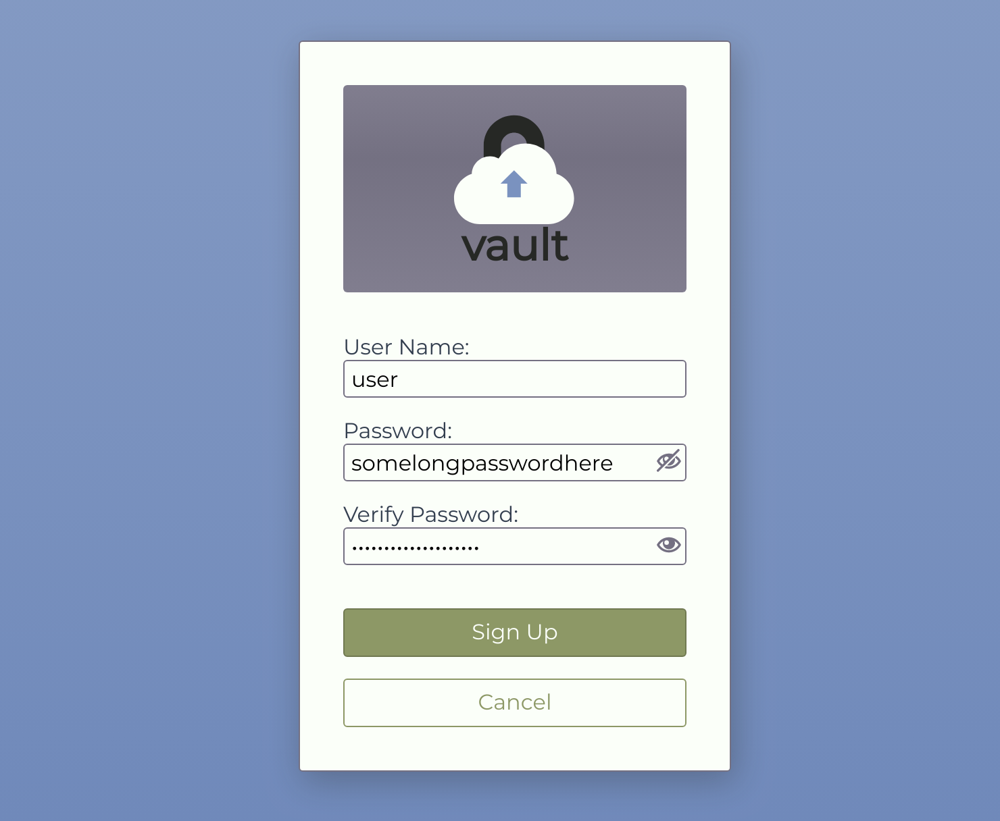
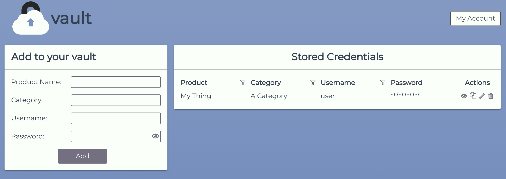

# vault

A minimalist self-hosted password manager, with completely encrypted communications. Works on mobile devices (with internet connection).

## Installation

* Clone the repo: `git clone https://github.com/kiswa/vault`
* Install dependencies: `npm install`

### Development

* Start the API: `npm run server:dev`
* Start the app: `npm start`

### Production

* Build the app: `npm run build`
* Copy ouputs: `cp -R dist/ /path/to/your/server/location/`
* Create ENV variable `SECRET` or edit `src/server/config.js` line 9
* Run the API: `npm run server &`

## Usage

On first use, you will need to sign up and create your user and password to log into the app in the future.

Then just start adding credentials you want to keep track of.

